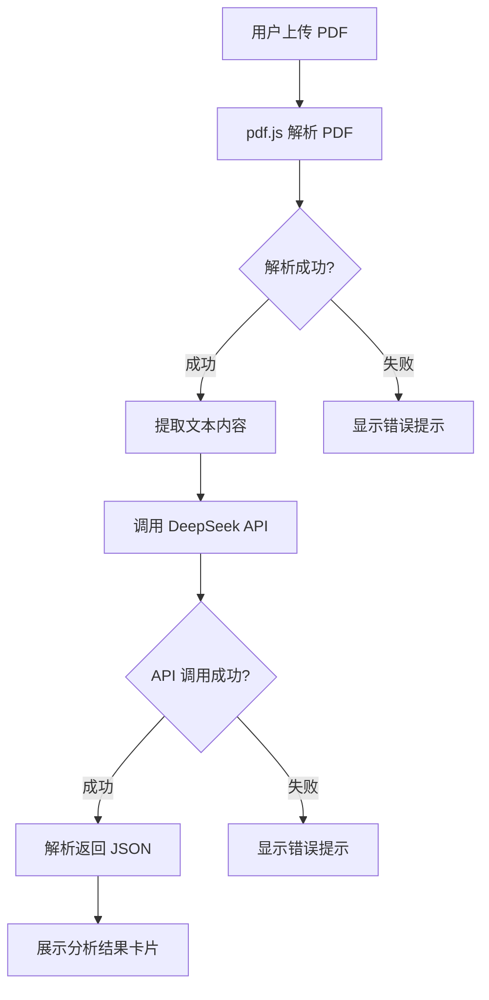

# 产品需求文档 (PRD)

## 1. 产品概述

学术论文解析工具 - 一款纯前端运行的智能学术论文分析应用。用户上传 PDF 学术论文后，在浏览器中提取全文内容，并调用 DeepSeek API 进行 AI 分析，最终以极简风格的卡片界面展示结果。

- **核心价值**：让研究人员和学者快速获取论文的核心洞察
- **目标用户**：研究人员、学者、学生
- **产品定位**：轻量级、即时可用的论文分析工具

## 2. 核心功能

### 2.1 功能模块

1. **PDF 上传模块**
   - 支持拖拽上传
   - 支持点击上传
   - 单文件 PDF 上传
   - 上传成功/失败状态反馈

2. **PDF 解析模块**
   - 使用 pdf.js 解析
   - 提取全部页面文字
   - 拼接为完整文本
   - 异步处理与加载状态

3. **AI 分析模块**
   - 调用 DeepSeek API
   - 提取核心概念、研究方法、关键发现、结论总结
   - JSON 格式返回解析
   - Loading 状态展示

4. **结果展示模块**
   - 三列卡片布局（桌面端）
   - 单列布局（移动端）
   - Key Findings 横向大卡片
   - 骨架屏效果

### 2.2 页面详情

| 页面区域 | 模块名称 | 功能描述 |
|---------|---------|---------|
| Header | 标题区域 | 显示应用名称和副标题 |
| 上传区 | 文件上传卡片 | 虚线边框，支持拖拽/点击上传 PDF |
| 结果区 | 分析结果卡片 | Core Concepts、Research Methods、Conclusion 三列 + Key Findings 横卡 |

## 3. 核心流程



## 4. 用户界面设计

### 4.1 设计风格

- **参考风格**：Apple 官网、Notion、Linear、Arc Browser
- **设计原则**：极简主义、大面积留白、圆角设计、卡片式布局
- **整体氛围**：柔和阴影、浅色背景 (#fafafa)

### 4.2 页面设计

| 页面区域 | 模块名称 | UI 元素 |
|---------|---------|---------|
| Header | 标题 | 24px 标题字体，16px 副标题 |
| 上传区 | 上传卡片 | 白色背景、24px 圆角、虚线边框、居中提示文案 |
| 结果区 | 结果卡片 | 白色背景、24px 圆角、图标 + 标题 + 内容 |

### 4.3 设计规范

- **页面宽度**：max-width 1200px，主体居中
- **背景色**：#fafafa
- **卡片圆角**：24px
- **按钮圆角**：16px
- **动画效果**：hover 微动效、fade-in 渐显、平滑过渡

### 4.4 响应式设计

- **桌面端**：3 列卡片布局
- **移动端**：单列布局
- **适配**：桌面端和移动端双端适配

## 5. 技术架构

### 5.1 技术栈

- **前端框架**：React 18 + Vite
- **样式**：Tailwind CSS
- **PDF 解析**：pdf.js
- **HTTP 请求**：Axios
- **无后端**：所有逻辑在浏览器端完成

### 5.2 环境变量

- `VITE_DEEPSEEK_API_KEY`：DeepSeek API 密钥

### 5.3 API 设计

**分析论文接口**

```
POST https://api.deepseek.com/v4/chat/completions
模型：deepseek-chat

请求内容：
{
  "model": "deepseek-chat",
  "messages": [
    {"role": "system", "content": "你是一名专业学术研究助手，请用简洁易懂的方式总结论文内容。"},
    {"role": "user", "content": "请分析以下学术论文，并返回：\n1. 核心概念\n2. 研究方法\n3. 关键发现\n4. 结论总结\n\n返回JSON格式：\n{\n\"concepts\": \"\",\n\"methods\": \"\",\n\"findings\": \"\",\n\"conclusion\": \"\"\n}\n\n论文内容：\n{text}"}
  ]
}

响应格式：
{
  "choices": [{
    "message": {
      "content": "{json字符串}"
    }
  }]
}
```

## 6. 错误处理

| 错误场景 | 处理方式 |
|---------|---------|
| PDF 解析失败 | Toast 提示 "Failed to read PDF" |
| API 调用失败 | Toast 提示 "Failed to analyze paper" |
| 无 API Key | 提示配置环境变量 |

## 7. 项目结构

```
/Users/daniu/Documents/TRAE小作品/
├── index.html
├── package.json
├── vite.config.js
├── tailwind.config.js
├── postcss.config.js
├── .env.example
├── src/
│   ├── main.jsx
│   ├── App.jsx
│   ├── index.css
│   ├── components/
│   │   ├── Header.jsx
│   │   ├── FileUpload.jsx
│   │   ├── ResultCard.jsx
│   │   └── LoadingSkeleton.jsx
│   └── utils/
│       ├── pdfParser.js
│       └── deepseekApi.js
└── .trae/
    └── documents/
        └── PRD.md
```
