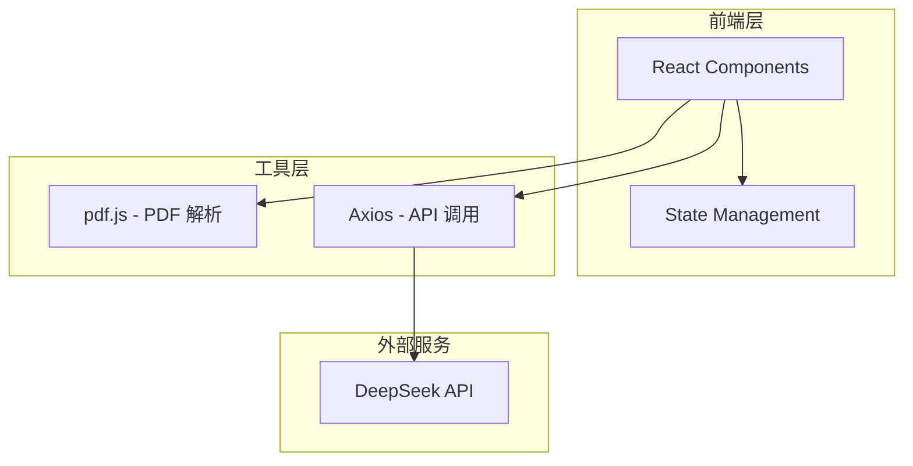

# 技术架构文档

## 1. 架构设计



## 2. 技术描述

### 2.1 技术栈

| 技术 | 版本 | 用途 |
|-----|------|-----|
| React | 18.x | 前端框架 |
| Vite | 5.x | 构建工具 |
| Tailwind CSS | 3.x | 样式框架 |
| pdf.js | 4.x | PDF 解析 |
| Axios | 1.x | HTTP 请求 |
| DeepSeek V4 API | - | AI 分析服务 |

### 2.2 项目初始化

```bash
npm create vite@latest . -- --template react
npm install
npm install -D tailwindcss postcss autoprefixer
npx tailwindcss init -p
npm install pdfjs-dist axios
```

## 3. 路由定义

本项目为单页应用，无需路由配置。所有功能在 App.jsx 中实现。

## 4. 组件结构

| 组件 | 文件路径 | 职责 |
|-----|---------|-----|
| Header | src/components/Header.jsx | 显示标题和副标题 |
| FileUpload | src/components/FileUpload.jsx | PDF 文件上传 |
| ResultCard | src/components/ResultCard.jsx | 分析结果卡片 |
| LoadingSkeleton | src/components/LoadingSkeleton.jsx | 加载骨架屏 |

## 5. 工具函数

| 函数 | 文件路径 | 职责 |
|-----|---------|-----|
| pdfParser | src/utils/pdfParser.js | 解析 PDF 文件 |
| deepseekApi | src/utils/deepseekApi.js | 调用 DeepSeek V4 API |

## 6. 环境变量

| 变量名 | 描述 | 必填 |
|-------|-----|-----|
| VITE_DEEPSEEK_API_KEY | DeepSeek API 密钥 | 是 |

## 7. 数据模型

### 7.1 分析结果模型

```typescript
interface AnalysisResult {
  concepts: string;    // 核心概念
  methods: string;      // 研究方法
  findings: string;    // 关键发现
  conclusion: string;  // 结论总结
}
```

### 7.2 应用状态

```typescript
interface AppState {
  pdfFile: File | null;           // 当前 PDF 文件
  pdfText: string;                // 提取的文本
  analysisResult: AnalysisResult | null;  // 分析结果
  isLoading: boolean;             // 加载状态
  error: string | null;           // 错误信息
}
```

## 8. 配置文件

### 8.1 vite.config.js

```javascript
import { defineConfig } from 'vite'
import react from '@vitejs/plugin-react'

export default defineConfig({
  plugins: [react()],
  server: {
    port: 5173,
    host: true
  }
})
```

### 8.2 tailwind.config.js

```javascript
/** @type {import('tailwindcss').Config} */
export default {
  content: [
    "./index.html",
    "./src/**/*.{js,ts,jsx,tsx}",
  ],
  theme: {
    extend: {
      colors: {
        background: '#fafafa',
      },
      borderRadius: {
        'card': '24px',
        'button': '16px',
      },
      maxWidth: {
        'container': '1200px',
      },
    },
  },
  plugins: [],
}
```

### 8.3 .env.example

```
VITE_DEEPSEEK_API_KEY=your_api_key_here
```
